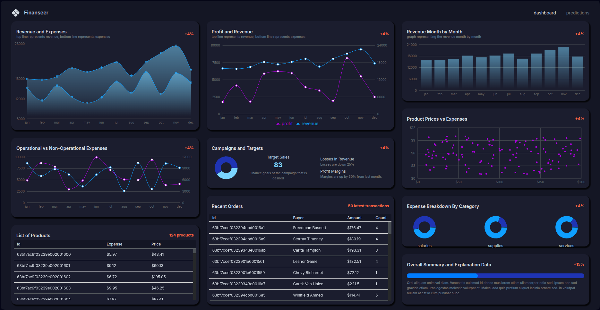

# Finance Dashboard App

[](https://nodejs.org/) [](https://www.mongodb.com/) [](https://vitejs.dev/) [](https://reactjs.org/) [](https://www.typescriptlang.org/)
A full‑stack MERN application featuring real‑time financial charts, CRUD operations on transactions, and basic ML‑powered trend prediction.

## 📸 Demo

<p align="center">
  
</p>

## ✨ Key Features

- 📊 Monitor financial KPIs on an interactive, responsive dashboard
- 🔄 Manage products and transactions via RESTful APIs
- 🤖 Predict future trends using integrated ML models
- 📈 Visualize data with Recharts charts and tables
- 🎨 Modern UI with Material-UI components
- 📱 Fully responsive design

## 🏗️ Project Structure

The repo is divided into two main folders:

- **server**: Backend code (Node.js, Express)
- **client**: Frontend code (React, Vite)

### Backend (`server`)

- **Node.js**: Runtime environment
- **Express.js**: Framework for handling HTTP requests and routing
- **MongoDB**: NoSQL database for storing financial data
- **Mongoose**: ODM for schema definition and validation

### Frontend (`client`)

- **Vite**: Fast build tool and development server
- **React**: Library for building user interfaces
- **TypeScript**: Type-safe JavaScript development
- **Redux Toolkit**: State management
- **Material UI**: Component library for UI elements
- **Recharts**: Library for interactive charts and graphs

## 🚀 Quick Start

```bash
# Clone the repository
git clone https://github.com/mahmoudhusam/finance-dashboard-app.git
cd finance-dashboard-app

# Install dependencies
cd server && npm install && cd ../client && npm install

# Run the application
# Terminal 1 - Backend:
cd server && npm start

# Terminal 2 - Frontend:
cd client && npm run dev
```

## ⚙️ Environment Variables

To run the app, you need to set up environment variables for both backend and frontend:

### Backend (`server/.env`)

Create a file named `.env` inside the `server` directory with:

```bash
MONGO_URI=<your MongoDB connection string>
PORT=<port number, e.g., 3001>
JWT_SECRET=<your JWT secret>
```

- `MONGO_URI`: Your MongoDB connection string.
- `PORT`: Port for the backend server (default: 3001).
- `JWT_SECRET`: Secret key for authentication.

### Frontend (`client/.env.local`)

Create a file named `.env.local` inside the `client` directory with:

```bash
VITE_BASE_URL=http://localhost:<port number used in server/.env>
```

- `VITE_BASE_URL`: The backend URL (should match the backend port).

This ensures the frontend connects to your backend correctly.

This sets the base URL for the frontend to connect to your backend.

## 🤝 Contributions & Feedback

Feel free to open an issue or submit a pull request to suggest improvements!
